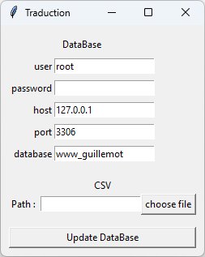
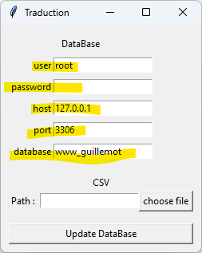
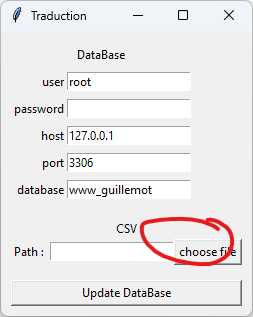
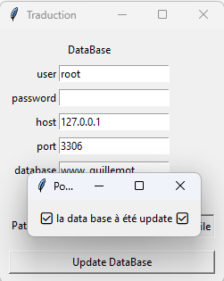

Auteur : Floran MARTEL

version : 1.0

date-dernière-version : 06/06/2024 


# Convertiseur CSV To WPJson


Cette ouille est une extension au plugin Polylang de WordPress pour insérer les traduction des source d'un fichier CSV dans la base de donner WordPress


Pour lancer l'application, allez dans votre terminal dans ce répertoire, puis faites

```
pip install tkinter
```
Aller dans le fichier src

```
cd src
```

Puis lancer le fichier main.py

```
python3 .\main.py
```

Cette application va se lancer




Vous allez rentrer les informations de votre base de données dans les champs de DataBAse



Puis choisissez le fichier.

Attention, le format du csv doit être séparé par des " ;"
et la première colonne doit être la clé string et l'entête de chaque langue doit être les 2 caractères qui représentent la langue dans polylang
exemple France == > fr




Puis cliqué sur update



Alors les traduction ce sont appliqué